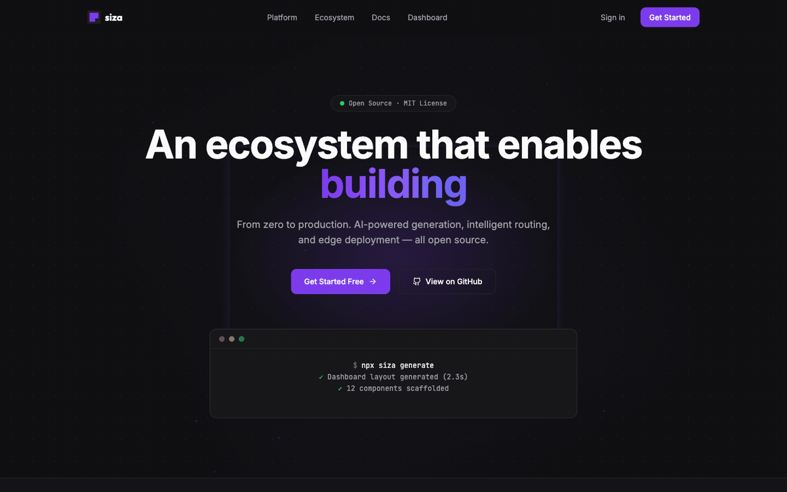

<div align="center">
  <a href="https://forgespace.co">
    
  </a>
  <h1>Siza</h1>
  <p>The open full-stack AI workspace — generate, integrate, ship.</p>
</div>

Every AI code tool generates beautiful frontends. Then you spend days wiring auth, database, APIs, and deployment. Siza owns the full-stack integration layer — from idea to production, zero lock-in.

[](https://github.com/Forge-Space/siza/actions/workflows/ci.yml)
[](https://opensource.org/licenses/MIT)
[](https://nodejs.org/)
[](https://nextjs.org/)
[](https://www.typescriptlang.org/)
[](https://workers.cloudflare.com/)
[](CONTRIBUTING.md)
[](https://github.com/Forge-Space/siza/discussions)

**Live**: [siza.forgespace.co](https://siza.forgespace.co)

\
**Dev**: [dev.forgespace.co](https://dev.forgespace.co)

## Why Siza

| What we are | What we're NOT |
|-------------|----------------|
| Open-source workspace you can self-host | Locked-in SaaS like v0.dev |
| Full-stack (UI + backend + deploy) | Frontend-only generator |
| MCP-native (composable AI tools) | Monolithic AI black box |
| Privacy-first (BYOK, zero telemetry) | Data-harvesting freemium |
| Generous free tier by default | Free trial with paywall |

## Features

- **AI-Powered Generation** — Natural language or screenshot to production-ready UI components
- **MCP-Native** — Generation, governance, migration, and branding capabilities composed via MCP
- **Privacy-First BYOK** — Bring Your Own Key with client-side AES-256 encryption
- **Generous Free Tier** — Cloudflare Workers + Supabase + Gemini free tiers give you a generous starting point at $0/month
- **Self-Hostable** — Run everything locally with Docker, MIT licensed
- **Multi-LLM** — Swap between Gemini, Claude, GPT without code changes
- **Production Ready** — Monaco editor, live preview, Stripe billing, feature flags
- **IDP Governance** — Software catalog, golden path templates, post-gen scorecard, dependency graph, API docs viewer, CI/CD visibility, governance plugins
- **Theme Generator** — Deterministic preset + seed-color theme generation in Generate flow

## UI Migration Status (March 2026)

- Design tokens migrated from `--siza-*` to `--forge-*` (Phase 2). App theming now uses `@forgespace/brand-guide` forge-tokens; legacy aliases (`--surface-0`, `--brand`, etc.) point to `--forge-*` for backward compatibility
- Dashboard shell chrome aligned to design-system structure (56px top bar, breadcrumbs, command search, notifications indicator, token-consistent backgrounds/borders)
- Auth shell rebuilt to centered 440px card + radial glow/pattern and updated sign-in/sign-up/forgot/reset form controls to design-system styling
- Landing page hero/nav/footer moved closer to flagship design-system hierarchy (public beta badge, production-grade hero line, docs secondary CTA, product/resources/company/legal footer columns)
- Projects surface now includes design-system-inspired grid/list toggle and upgraded card presentation with framework badges and progress bars
- Unified dashboard route metadata for `Sidebar`, `MobileNav`, and breadcrumb/page title resolution
- Added migration primitives (`AuthCardShell`, `MarketingSection`, `DashboardSection`) and shared style utilities in `globals.css`
- Migrated mapped route visuals across landing/about/auth/dashboard surfaces while preserving behavior contracts (middleware, OAuth callback, query-param pages)
- Redesigned gap routes (`reset-password`, legal pages, maintenance, billing success) into the current Siza visual language
- Added role-aware dashboard navigation and a new Admin page for feature flag management
- Landing page performance pass: removed force-dynamic homepage personalization,
  switched to static public CTAs, and replaced Motion-heavy above-the-fold effects
  with server-rendered sections and CSS transitions
- Lighthouse accessibility pass: raised subtle text contrast token and aligned
  footer/code-surface secondary text to contrast-safe values

## Quick Start

```bash
git clone https://github.com/Forge-Space/siza.git
cd siza
npm install
supabase start
supabase db push
npm run dev
```

Open [localhost:3000](http://localhost:3000). Supabase Studio at [localhost:54323](http://localhost:54323).

### Environment Setup

Create `apps/web/.env.local`:

```env
NEXT_PUBLIC_SUPABASE_URL=http://localhost:54321
NEXT_PUBLIC_SUPABASE_ANON_KEY=your-local-anon-key
SUPABASE_SERVICE_ROLE_KEY=your-local-service-role-key
GEMINI_API_KEY=your-gemini-key
# Optional backup capacity for quota/rate-limit fallback
ANTHROPIC_API_KEY=your-anthropic-key
NEXT_PUBLIC_ENABLE_BYOK=true
NEXT_PUBLIC_ENABLE_GEMINI_FALLBACK=true
```

### Generation reliability behavior

- Siza defaults to `siza -> google` routing for shared free-tier generation
- On provider quota/rate-limit, the server falls back to Anthropic when `ANTHROPIC_API_KEY` is configured
- Fallback never reuses the primary provider BYOK key for backup provider calls
- When no backup capacity is configured, users get explicit capacity guidance with BYOK next steps

### Grant admin access locally

Create/sign in the target user first, then run:

```bash
npm run admin:grant -- lucas.diassantana@gmail.com
```

This updates `public.profiles.role` to `admin` for that email.

## Architecture

```
forge-patterns (shared standards)
    |
    v
mcp-gateway (AI tool routing) --> siza-mcp (UI/backend generation tools)
    |                              branding-mcp (brand identity tools)
    v
siza (this repo)
├── apps/web      — Next.js 16 frontend (Cloudflare Workers)
├── apps/desktop  — Electron desktop app (local Ollama + MCP)
└── apps/api      — Backend API service
```

### Stack

| Layer | Technology |
|-------|------------|
| Frontend | Next.js 16 (App Router), React 19, TypeScript 5.7 |
| UI | Tailwind CSS, shadcn/ui, Radix, Monaco Editor |
| State | Zustand, TanStack Query |
| Auth/DB | Supabase (PostgreSQL 15, Auth, Realtime, Storage) |
| AI | Gemini 2.0 Flash, Anthropic SDK, MCP SDK |
| Email | Resend + react-email templates |
| Billing | Stripe (Checkout, Portal, Webhooks) |
| Deploy | Cloudflare Workers via OpenNext |
| Monorepo | Turborepo |

## Project Structure

```
siza/
├── apps/
│   ├── web/                  # Next.js 16 frontend
│   │   ├── src/app/          # App Router pages & API routes
│   │   ├── src/components/   # shadcn/ui components
│   │   ├── src/lib/          # Auth, Stripe, usage, features
│   │   └── e2e/              # Playwright E2E tests
│   ├── docs/                 # Fumadocs documentation site
│   ├── desktop/              # Electron desktop app
│   └── api/                  # Backend API service
├── packages/
│   ├── ui/                   # @siza/ui shared component library
│   └── eslint-config/        # Shared ESLint config
├── supabase/                 # Migrations (10), seed data
└── turbo.json                # Turborepo config
```

## Development

```bash
npm run dev             # Start dev server (localhost:3000)
npm run build           # Build for production
npm run lint            # ESLint
npm test                # Unit tests (Jest)
npm run test:e2e        # E2E tests (Playwright)
npm run type-check      # TypeScript
npm run sync:golden-paths # Sync official Golden Paths seeds
npm run sync:skills     # Sync official skills from skills/*/SKILL.md
```

### Playwright MCP Wrapper (Codex Runtime)

If Codex Playwright MCP calls fail with `Transport closed`, use the local wrapper
that bridges Content-Length and newline JSON-RPC transport styles.

```bash
codex mcp remove playwright
codex mcp add playwright -- \
  node /absolute/path/to/siza/scripts/playwright-mcp-wrapper.mjs --headless
```

Local smoke check:

```bash
npm run mcp:playwright:wrapper -- --help
```

### Governance Asset Sync

Siza keeps official governance assets (Golden Paths and Skills) syncable from repository sources.

```bash
npm run sync:golden-paths
npm run sync:skills
```

Required environment variables:

- `SUPABASE_SERVICE_ROLE_KEY`
- `SUPABASE_URL` or `NEXT_PUBLIC_SUPABASE_URL`

### Generation E2E modes

- Default CI-safe suite uses mocked `/api/generate` SSE for deterministic generation/preview assertions
- Optional live-provider smoke test is gated behind `E2E_LIVE_PROVIDER=true`
- Live smoke uses BYOK provider selection (`GEMINI_API_KEY` or `ANTHROPIC_API_KEY`)
- If Gemini preflight returns quota/rate-limit (`HTTP 429`), smoke auto-switches to Anthropic when available
- If Gemini is quota-limited and Anthropic key is unavailable, smoke skips with an explicit reason
- Live smoke prerequisites: `SUPABASE_SERVICE_ROLE_KEY`, `NEXT_PUBLIC_SUPABASE_URL`, and at least one provider key (`GEMINI_API_KEY` or `ANTHROPIC_API_KEY`)

## CI Security Hygiene

- GitHub Actions and reusable workflow references in `.github/workflows/` are pinned to full commit SHAs.
- Placeholder DNS/IP examples in UI/test fixtures avoid real private-network literals.
- Regex-based content extraction paths use bounded or parser-based logic to reduce ReDoS risk.
Project operation notes for AI agents and contributors are in
[AGENTS.md](AGENTS.md).

## Live Ecosystem Sync (Marketing)

Marketing pages consume a server-only GitHub metadata sync for the Forge Space
ecosystem (`repo count`, `latest release tag`, `recent activity`).

- Sync source: GitHub REST API (`Forge-Space` org)
- Cache strategy: `revalidate: 21600` (6 hours)
- Resilience: static fallback snapshot if GitHub is unavailable/rate-limited

Optional authentication (for higher GitHub API limits):

```env
FORGE_SPACE_GITHUB_TOKEN=ghp_...
# fallback when FORGE_SPACE_GITHUB_TOKEN is unset
GITHUB_TOKEN=ghp_...
```

## SEO and Indexability (Marketing)

Siza uses an explicit SEO contract for marketing and legal pages.

Indexable routes:

- `/`
- `/about`
- `/roadmap`
- `/pricing`
- `/docs`
- `/gallery`
- `/legal/privacy`
- `/legal/terms`

Technical behavior:

- Route-level metadata map with canonical, title, description, keywords, Open Graph, and Twitter fields
- `robots.txt` and `sitemap.xml` are generated from the marketing route allowlist
- `/landing` is excluded from indexing (redirect target only)
- Non-marketing surfaces are noindex/disallowed (`/api/*`, dashboard/app/auth/onboarding/utility paths)
- Marketing pages are static/ISR-friendly and do not depend on server auth state
- Structured data:
  - Homepage: `Organization` + `WebSite` + `SoftwareApplication`
  - Marketing/legal pages: `WebPage` JSON-LD

## Pricing

Free for individuals, paid for scale and convenience.

| Tier | Price | Generations | Projects |
|------|-------|-------------|----------|
| Free | $0 forever | 10/month (BYOK unlimited) | 2 |
| Pro | $19/month | 500/month | Unlimited |
| Team | $49/month (5 seats) | 2,500/month | Unlimited |
| Enterprise | Custom | Unlimited | Unlimited |

## The Forge Space Ecosystem

Siza is part of [Forge Space](https://github.com/Forge-Space) — 11 product
repositories that ship as one open platform:

| Repo | Purpose |
|------|---------|
| **[siza](https://github.com/Forge-Space/siza)** | AI workspace (this repo) |
| **[core](https://github.com/Forge-Space/core)** | Shared standards and governance contracts |
| **[mcp-gateway](https://github.com/Forge-Space/mcp-gateway)** | MCP routing and reliability hub |
| **[ui-mcp](https://github.com/Forge-Space/ui-mcp)** | MCP protocol adapter for generation/migration |
| **[siza-gen](https://github.com/Forge-Space/siza-gen)** | AI generation engine and quality context |
| **[forge-ai-init](https://github.com/Forge-Space/forge-ai-init)** | Governance CLI and migration analysis |
| **[forge-ai-action](https://github.com/Forge-Space/forge-ai-action)** | CI quality gates for pull requests |
| **[branding-mcp](https://github.com/Forge-Space/branding-mcp)** | Brand identity MCP toolkit |
| **[brand-guide](https://github.com/Forge-Space/brand-guide)** | Design tokens and identity source |
| **[forgespace-web](https://github.com/Forge-Space/forgespace-web)** | Forge Space marketing website |
| **[siza-desktop](https://github.com/Forge-Space/siza-desktop)** | Local-first desktop companion app |

## Deployment

### Cloudflare Workers (Production)

Automated via GitHub Actions on push to `main` (production) or `dev` (preview):

1. Set GitHub Secrets: `CLOUDFLARE_API_TOKEN`, `CLOUDFLARE_ACCOUNT_ID`, `NEXT_PUBLIC_SUPABASE_URL`, `NEXT_PUBLIC_SUPABASE_ANON_KEY`, `NEXT_PUBLIC_BASE_URL`
2. Set GitHub Variable: `CLOUDFLARE_DEPLOY_ENABLED=true`
3. Deployment runs automatically via `deploy-web.yml`

### Free Tier Architecture

| Service | Free Tier |
|---------|-----------|
| Cloudflare Workers | Unlimited bandwidth |
| Supabase | 50K MAU, 500MB DB, 1GB storage |
| Gemini 2.0 Flash | 60 RPM |
| GitHub Actions | 2,000 min/month |

## Documentation

Full documentation is available in the `apps/docs/` directory, built with [Fumadocs](https://fumadocs.vercel.app/):

```bash
npm run dev --workspace=apps/docs  # localhost:3001
```

Covers: quick start, self-hosting, configuration, MCP integration, API reference, and architecture.

## Community

- [**GitHub Discussions**](https://github.com/Forge-Space/siza/discussions) — questions, ideas, show & tell
- [**Issue Templates**](https://github.com/Forge-Space/siza/issues/new/choose) — bug reports, feature requests, security reports
- [**Contributing Guide**](CONTRIBUTING.md) — how to contribute code and docs

## Contributing

We welcome contributions. See [CONTRIBUTING.md](CONTRIBUTING.md) for guidelines.

1. Fork the repo
2. Create a feature branch from `main`
3. Make changes, run `npm run lint && npm test && npm run build`
4. Open a PR against `main`

## License

MIT — see [LICENSE](LICENSE).

---

Part of the [Forge Space](https://github.com/Forge-Space) ecosystem.
