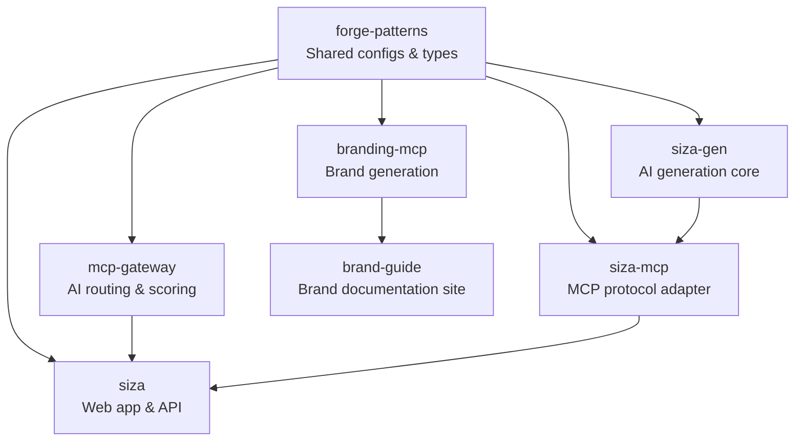

Siza is built as a distributed ecosystem of seven repositories, each with a clear responsibility.

## Repository Map



## Repositories

### siza (Web App + Desktop)

**GitHub:** [Forge-Space/siza](https://github.com/Forge-Space/siza)

The main application. A Turborepo monorepo with web, desktop, docs, and shared UI.

| App            | Purpose                                                 |
| -------------- | ------------------------------------------------------- |
| `apps/web`     | Next.js frontend (dashboard, editor, preview, billing)  |
| `apps/desktop` | Electron desktop app with local MCP + Ollama            |
| `apps/docs`    | Fumadocs documentation site                             |
| `apps/api`     | Cloudflare Workers API with AI provider integrations    |
| `packages/ui`  | Shared `@siza/ui` component library (shadcn/ui + Radix) |

**Stack:** Next.js 16, React 19, Electron, Supabase, Stripe, Tailwind CSS, shadcn/ui, Monaco Editor

### siza-gen (AI Generation Core)

**GitHub:** [Forge-Space/siza-gen](https://github.com/Forge-Space/siza-gen)

The extracted AI brain — contains all generation logic, ML composition, quality scoring, and the 500+ snippet registry. Published as `@forgespace/siza-gen` on npm.

**Key modules:**

- AI layer — prompt engineering, multi-provider routing, quality scoring
- Generators — component, page, application, prototype generators
- Registry — 500+ curated UI snippets (components, animations, backend patterns)

### siza-mcp (MCP Server)

**GitHub:** [Forge-Space/ui-mcp](https://github.com/Forge-Space/ui-mcp)

Thin MCP protocol adapter that exposes 21 tools to any MCP-compatible IDE. Delegates all generation logic to `@forgespace/siza-gen`.

**Key features:**

- Multi-framework code generation (React, Vue, Svelte, Angular, HTML)
- ML composition pipeline with quality scoring
- RAG-based design reference matching
- Template packs for full-app scaffolding
- Feedback loop for continuous improvement

### mcp-gateway (AI Gateway)

**GitHub:** [Forge-Space/mcp-gateway](https://github.com/Forge-Space/mcp-gateway)

Python service that routes AI requests across multiple providers (Gemini, Claude, GPT) with intelligent selection, scoring, and caching.

### forge-patterns (Core Library)

**GitHub:** [Forge-Space/core](https://github.com/Forge-Space/core)

Shared configurations, TypeScript types, security framework, and ecosystem standards. Every other repository depends on this.

### branding-mcp (Brand Generation)

**GitHub:** [Forge-Space/branding-mcp](https://github.com/Forge-Space/branding-mcp)

MCP server specialized in brand identity generation — logos, color palettes, typography, brand guidelines, and AI-powered brand interpretation.

### brand-guide (Brand Documentation)

**GitHub:** [Forge-Space/brand-guide](https://github.com/Forge-Space/brand-guide)

Astro-based static site documenting the Siza brand identity. Exports design tokens in CSS, W3C JSON, Tailwind, Sass, and React formats. Generated from `branding-mcp`.

## Data Flow

### Component Generation (Web App)

```
User prompt -> Web App -> AI Provider (Gemini/Claude/OpenAI) -> Generated code -> Preview -> Export
```

### Component Generation (MCP)

```
IDE prompt -> siza-mcp -> siza-gen -> RAG lookup -> ML composition -> Quality scoring -> Generated code
```

### Component Generation (Desktop)

```
Desktop app -> Local Ollama / Cloud API -> siza-mcp -> siza-gen -> Generated code -> Local filesystem
```

### Subscription Flow

```
User -> Stripe Checkout -> Webhook -> Supabase sync -> Plan limits enforced
```

## Technology Stack

| Layer    | Technology                                               |
| -------- | -------------------------------------------------------- |
| Frontend | Next.js 16, React 19, Electron, Tailwind CSS, shadcn/ui  |
| Backend  | Cloudflare Workers, Supabase (Postgres + Auth + Storage) |
| AI       | Google Gemini, Anthropic Claude, OpenAI GPT, Ollama      |
| MCP      | TypeScript MCP server, SQLite (RAG), vector search       |
| Gen Core | @forgespace/siza-gen (AI, generators, registry)          |
| Gateway  | Python, Redis, FastAPI                                   |
| Deploy   | Cloudflare Workers (OpenNext), GitHub Actions CI/CD      |
| Shared   | forge-patterns (TypeScript, ESLint, security)            |
