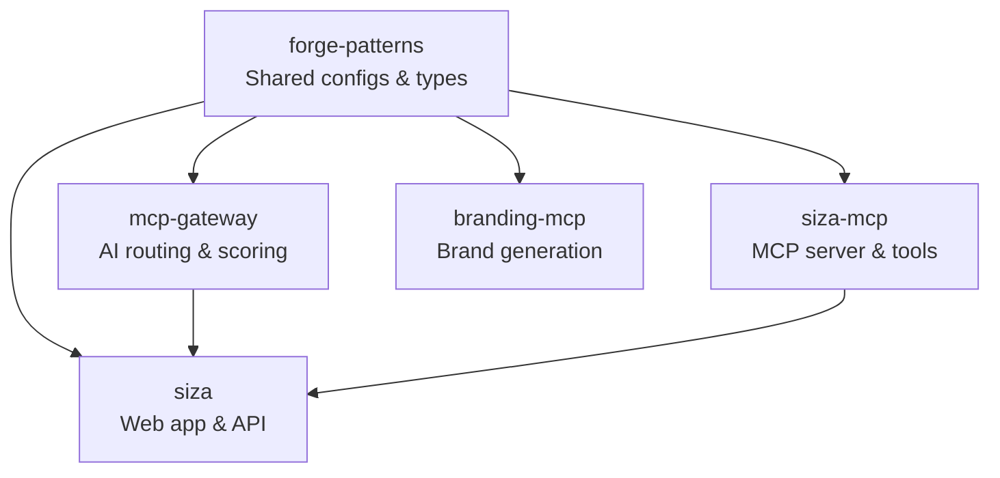

Siza is built as a distributed ecosystem of five repositories, each with a clear responsibility.

## Repository Map



## Repositories

### siza (Web App)

**GitHub:** [Forge-Space/siza](https://github.com/Forge-Space/siza)

The main web application. A Next.js monorepo deployed to Cloudflare Workers.

| App        | Purpose                                                |
| ---------- | ------------------------------------------------------ |
| `apps/web` | Next.js frontend (dashboard, editor, preview, billing) |
| `apps/api` | Cloudflare Workers API with AI provider integrations   |

**Stack:** Next.js 16, React 19, Supabase, Stripe, Tailwind CSS, shadcn/ui, Monaco Editor

### siza-mcp (MCP Server)

**GitHub:** [Forge-Space/ui-mcp](https://github.com/Forge-Space/ui-mcp)

Model Context Protocol server with 17 tools for AI-powered UI generation. Runs as a standalone process that any MCP-compatible IDE can connect to.

**Key features:**

- Multi-framework code generation (React, Vue, Svelte, Angular, HTML)
- ML composition pipeline with quality scoring
- RAG-based design reference matching
- Template packs for full-app scaffolding
- Feedback loop for continuous improvement

### mcp-gateway (AI Gateway)

**GitHub:** [Forge-Space/mcp-gateway](https://github.com/Forge-Space/mcp-gateway)

Python service that routes AI requests across multiple providers (Gemini, Claude, GPT) with intelligent selection, scoring, and caching.

**Key features:**

- Multi-provider AI routing with cost optimization
- Pattern matching and scoring algorithms
- Training pipeline for model improvement
- Redis caching layer

### forge-patterns (Core Library)

**GitHub:** [Forge-Space/core](https://github.com/Forge-Space/core)

Shared configurations, TypeScript types, security framework, and ecosystem standards. Every other repository depends on this.

**Provides:**

- Shared TypeScript types and interfaces
- ESLint and Prettier configurations
- Security scanning utilities
- MCP context server for ecosystem-wide knowledge

### branding-mcp (Brand Generation)

**GitHub:** [Forge-Space/branding-mcp](https://github.com/Forge-Space/branding-mcp)

MCP server specialized in brand identity generation — logos, color palettes, typography, and brand guidelines.

## Data Flow

### Component Generation (Web App)

```
User prompt → Web App → AI Provider (Gemini) → Generated code → Preview → Export
```

### Component Generation (MCP)

```
IDE prompt → siza-mcp → RAG lookup → ML composition → Quality scoring → Generated code
```

### Subscription Flow

```
User → Stripe Checkout → Webhook → Supabase sync → Plan limits enforced
```

## Technology Stack

| Layer    | Technology                                               |
| -------- | -------------------------------------------------------- |
| Frontend | Next.js 16, React 19, Tailwind CSS, shadcn/ui            |
| Backend  | Cloudflare Workers, Supabase (Postgres + Auth + Storage) |
| AI       | Google Gemini, Anthropic Claude, OpenAI GPT              |
| MCP      | TypeScript MCP server, SQLite (RAG), vector search       |
| Gateway  | Python, Redis, FastAPI                                   |
| Deploy   | Cloudflare Workers (OpenNext), GitHub Actions CI/CD      |
| Shared   | forge-patterns (TypeScript, ESLint, security)            |
